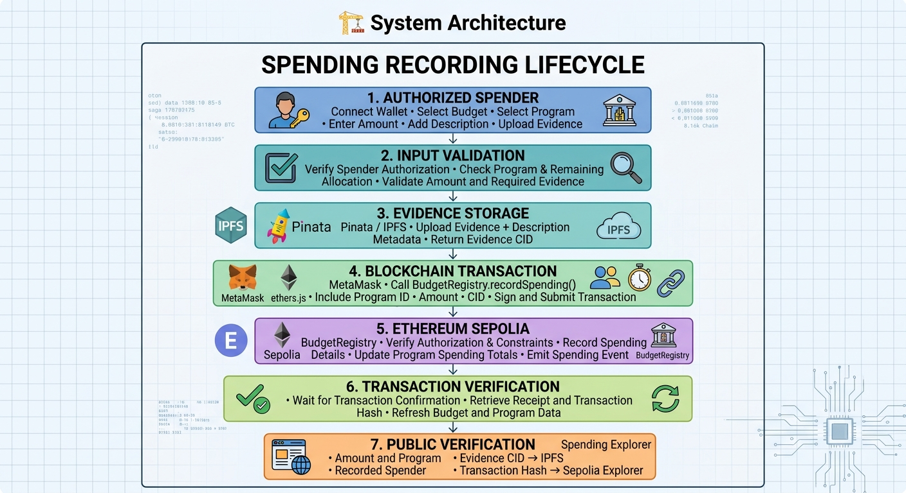
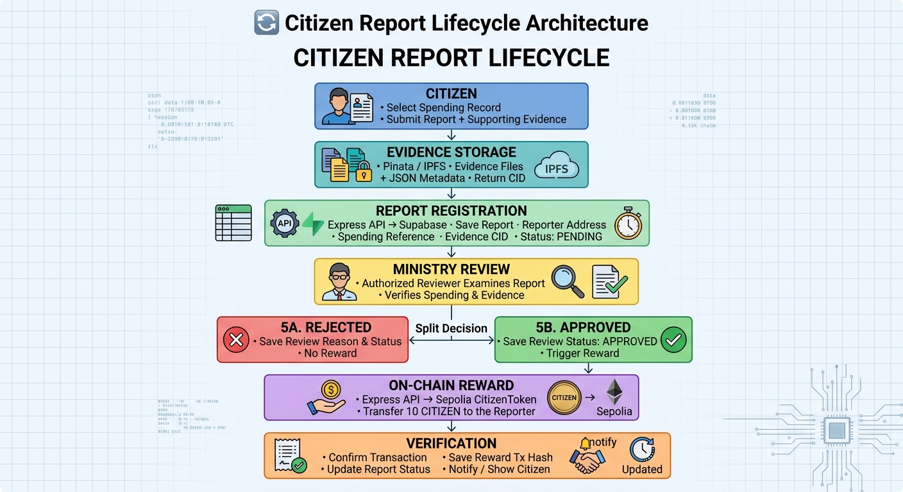

# open-treasury — Blockchain-Based Government Budget Transparency

[](https://soliditylang.org/)
[](https://sepolia.etherscan.io/)
[](https://metamask.io/)
[](https://www.pinata.cloud/)
[](https://react.dev/)
[](https://tailwindcss.com/)
[](https://expressjs.com/)
[](https://supabase.com/)
[](LICENSE)

**OpenTreasury** is a blockchain-powered government budget transparency platform designed to make public spending more transparent, accountable, and verifiable. It enables authorized ministries to publish budgets, authorized spenders to record program expenditures, and citizens to inspect spending records and submit evidence-backed reports about potential issues.

The platform combines smart contracts, decentralized evidence storage, and citizen participation to help improve accountability in public financial management.

> **Network:** Ethereum Sepolia Testnet\
> **Native reward token:** CITIZEN
              
## Live Dapp              

**Try OpenTreasury:** 
[Launch the OpenTreasury DApp](https://sepolia.etherscan.io/address/0x41734299008C7FF12EE501558bA8E60c86134D34)

## Table of Contents

- [Overview](#overview)
- [Problem Statement](#problem-statement)
- [Our Solution](#our-solution)
- [Key Features](#key-features)
- [Business Model](#business-model)
- [How It Works](#how-it-works)
- [Technology Stack](#technology-stack)
- [System Architecture](#system-architecture)
- [Smart Contracts](#smart-contracts)
- [Evidence Storage](#evidence-storage)
- [Citizen Reporting and Rewards](#citizen-reporting-and-rewards)
- [User Roles](#user-roles)
- [Getting Started](#getting-started)
- [Environment Configuration](#environment-configuration)
- [Running the Application](#running-the-application)
- [Testing and Deployment](#testing-and-deployment)
- [Security Considerations](#security-considerations)
- [Roadmap](#roadmap)
- [Contributing](#contributing)
- [Disclaimer](#disclaimer)

## Overview

Government budgets are public resources, but following the flow of allocated funds, program expenditures, and supporting documentation can be difficult. OpenTreasury explores how blockchain technology can provide a transparent, auditable record of public spending while giving citizens a practical way to participate in oversight.

The platform records budget and spending information on an Ethereum-compatible blockchain. Supporting documents are stored on IPFS, with their content identifiers (CIDs) associated with spending records or citizen reports.

OpenTreasury also introduces a citizen participation incentive: when an authorized ministry approves an eligible citizen report, the reporter can receive **10 CITIZEN tokens**.

## Problem Statement

Traditional public spending oversight can face several challenges:

- Limited public access to understandable spending records.
- Difficulty verifying whether recorded expenditures have supporting evidence.
- Risk of records being changed without a clear audit trail.
- Limited opportunities for citizens to participate in expenditure oversight.
- Lack of direct incentives for citizens who contribute useful evidence.

OpenTreasury aims to address these challenges through transparent records, evidence-linked reporting, role-based permissions, and citizen rewards.

## Our Solution

OpenTreasury connects government budget management with public oversight.

1. **On-chain budget records:** Authorized ministries create and manage budget records.
2. **Program-level allocation:** Ministries organize budgets into programs with allocated amounts.
3. **Spending records:** Authorized spenders record expenditures and link supporting evidence.
4. **Decentralized evidence:** Documents and descriptions are stored on IPFS.
5. **Public exploration:** Citizens can inspect budgets, programs, spending records, and associated evidence.
6. **Citizen auditing:** Citizens submit reports identifying potential issues in public spending.
7. **Ministry review:** Authorized ministry representatives approve or reject submitted reports.
8. **Token incentives:** Approved reports can trigger a reward of 10 CITIZEN tokens for the reporter.

## Key Features

### Budget management

- Create budget records for ministries and fiscal years.
- Record allocated and disbursed amounts.
- Organize budgets into individual programs.
- Track program allocations and recorded spending.
- Provide public access to relevant budget information.

### Spending transparency

- Record expenditure amounts on-chain.
- Associate expenditures with their respective programs.
- Link spending records to supporting evidence.
- Explore spending activity and supporting documentation.

### Evidence-backed records

- Upload invoices, receipts, PDFs, images, and other supporting files.
- Store evidence and descriptive metadata on IPFS.
- Reference the stored evidence through a CID.
- Retrieve evidence for inspection and verification.

### Citizen reporting

- Submit reports about spending records.
- Attach descriptions and supporting evidence.
- Track report status.
- View ministry review decisions and reasons.
- Access recorded reward transactions for approved reports.

### Citizen incentives

- Reward approved reports with 10 CITIZEN tokens.
- Record reward transactions on Ethereum Sepolia.
- Prevent duplicate rewards for the same report using an on-chain report identifier.
- Provide transaction links for independent verification.

### Role-based access

- Public users can explore information.
- Authorized ministries can manage permitted budget operations and review reports.
- Authorized spenders can perform permitted spending operations.

Access to privileged actions is intended to be enforced by the smart contracts and relevant backend authorization checks.

## Business Model
**Who pays, and why?**

- **Government ministries and municipalities:** Pay subscription or deployment fees to manage budgets, publish spending records, and improve public accountability.
- **NGOs and donor organizations:** Pay to track funded projects, verify spending evidence, and provide transparent reports to donors.
- **Auditing and oversight organizations:** Pay for advanced analytics, audit trails, and spending verification tools.

**Citizen incentives:** Citizens use OpenTreasury to inspect public spending and report suspicious or unsupported expenses. When a report is approved, the citizen can receive 10 CITIZEN tokens as a reward.

**Value proposition:** OpenTreasury helps institutions demonstrate responsible use of public funds, reduces the cost of transparency and reporting, and strengthens public trust through verifiable blockchain records.

## How It Works

### 1. Ministry creates a budget

An authorized ministry creates a budget for a fiscal year and records the allocation.

### 2. Ministry creates programs

The ministry divides the budget into programs, assigning each program an allocation. Program allocation is reflected in the budget's disbursed amount according to the project's accounting model.

### 3. Spender records an expenditure

An authorized spender records a spending transaction and associates it with a program.

The record includes an amount and an IPFS content identifier for its supporting evidence.

### 4. Citizen inspects the record

Citizens can explore the spending information and inspect the evidence associated with it.

### 5. Citizen submits a report

A citizen submits a report containing a description and supporting evidence concerning a spending record.

### 6. Ministry reviews the report

An authorized ministry representative reviews the submission and approves or rejects it, optionally providing a reason.

### 7. Approved report earns a reward

When an eligible report is approved, the reward mechanism calls the CITIZEN token contract to issue 10 tokens to the reporter.

The reward transaction hash is saved with the report so the result can be checked on the blockchain.

## Technology Stack

| Layer                  | Technologies                |
| ---------------------- | --------------------------- |
| Smart contracts        | Solidity, Foundry           |
| Blockchain             | Ethereum Sepolia Testnet    |
| Wallet                 | MetaMask                    |
| Evidence storage       | IPFS, Pinata                |
| Blockchain integration | ethers.js                   |
| Smart contract testing | Foundry tests, fuzz testing |
| Frontend               | React, Vite, JavaScript     |
| Styling                | Tailwind CSS                |
| State management       | Zustand                     |
| Backend                | Node.js, Express.js         |
| Database               | Supabase                    |
| File uploads           | Multer                      |
| API middleware         | CORS, dotenv                |


## System Architecture
```💸 Overall Architecture```


```💸 Spending Recording Architecture```



```🔄 Citizen Report Lifecycle Architecture```



The blockchain is used for budget and spending records and token rewards. Supabase stores application-level citizen report information, while IPFS stores evidence files and their metadata.

## Smart Contracts

### 1. BudgetRegistry

The `BudgetRegistry` contract manages budget-related records and permissions.

Its data model includes:

- **Budget:** Ministry, fiscal year, allocated amount, disbursed amount, creator, creation timestamp, and active status.
- **Program:** Associated budget, name, allocation, recorded spending, and active status.
- **Spending:** Associated program, amount, evidence CID, recorder, and timestamp.
- **Authorization:** Permissions for ministries and spenders.

The contract is designed to provide an auditable record of budget allocations and recorded expenditures.

**Configured Sepolia deployment:**

`0x41734299008C7FF12EE501558bA8E60c86134D34`

[View BudgetRegistry on Sepolia Etherscan](https://sepolia.etherscan.io/address/0x41734299008C7FF12EE501558bA8E60c86134D34)

Verify that this deployment is still the correct one for your current application before using the address in a release.

### 2. CitizenToken

`CitizenToken` is the ERC-20 reward token used to incentivize citizen participation.

| Property         | Value                                     |
| ---------------- | ----------------------------------------- |
| Token name       | Citizen Token                             |
| Symbol           | CITIZEN                                   |
| Decimals         | 18                                        |
| Report reward    | 10 CITIZEN                                |
| Reward recipient | Citizen who submitted the approved report |

[View CitizenToken  on Sepolia Etherscan](https://sepolia.etherscan.io/address/0x9a2FA1A0075240842C3d328b65D465bE1F814363)

The reward contract uses a report identifier to prevent the same report from being rewarded more than once. The authorized token owner can call the reward function, and a successful reward emits a `CitizenRewarded` event.

**Deployment address:** Configure your actual deployed CitizenToken address in the environment variables. Do not publish a placeholder as if it were a real deployment.

### Contract security notes

- Ministry and spender permissions should be verified on-chain.
- Only authorized accounts should be able to perform privileged operations.
- Reward issuance must be restricted to the intended authorized caller.
- Report identifiers must be unique and consistently generated.
- Smart contract tests should cover access control, accounting, duplicate rewards, and edge cases.

## Evidence Storage

OpenTreasury uses IPFS through Pinata to store supporting documentation.

Evidence may include:

- Invoices and receipts.
- PDF documents.
- Images.
- Other supporting files accepted by the application.
- A description explaining the purpose of the expenditure or report.

The application stores an IPFS CID with the relevant record or report metadata. The CID can be used to retrieve the associated content through a configured IPFS gateway.

**Why IPFS?**

- Content-addressed references make it possible to verify that retrieved content matches its identifier.
- Large files can be stored without placing their complete contents directly on-chain.
- Evidence can be retrieved independently of the application database, provided the content remains available.

**Important:** IPFS does not automatically guarantee permanent availability, document authenticity, or confidentiality. Pinning and retention arrangements are needed for availability, and sensitive information should not be uploaded publicly without appropriate safeguards.

## Citizen Reporting and Rewards

Citizen reporting connects public oversight with a verifiable incentive mechanism.

### Report lifecycle

```🔄 Citizen Report Lifecycle Architecture```


### Reward rules

- Reports begin with a `Pending` status.
- An authorized reviewer decides whether to approve or reject a report.
- An approved eligible report triggers a 10 CITIZEN reward.
- A rejected report does not receive a reward through the approval workflow.
- The report stores the reward transaction hash when available.
- The token contract tracks rewarded report identifiers to prevent duplicate issuance.

Token rewards are a testnet prototype incentive, not a guarantee of monetary value. The ministry's approval process also does not, by itself, prove that a reported allegation is factually correct.

## User Roles

### Public citizen

- Browse public budget and spending information.
- Inspect evidence associated with spending records.
- Submit reports with descriptions and supporting files.
- Track report status and review outcomes.
- View reward transaction details when available.

### Authorized ministry

- Perform permitted budget management operations.
- Create programs under authorized budgets.
- Review citizen reports.
- Approve or reject reports with a review reason.

### Authorized spender

- Access permitted spending operations.
- Record expenditures for assigned programs.
- Associate expenditure records with supporting evidence.

Exact permissions depend on the deployed smart contracts and backend implementation.

## Getting Started

### Prerequisites

Install or prepare the following:

- Node.js and npm.
- Git.
- Foundry for compiling, testing, and deploying Solidity contracts.
- MetaMask configured for Ethereum Sepolia.
- A Sepolia RPC endpoint from a provider.
- A Supabase project.
- A Pinata account with API credentials.
- Sepolia ETH for deployment, transactions, and token rewards.

### 1. Clone the repository

```
git clone https://github.com/molalign8468/open-treasury
cd open-treasury
```

### 2. Install frontend dependencies

From the repository root, if it contains the frontend `package.json`:

```
cd app
npm install
```

### 3. Install backend dependencies

```
cd api
npm install
```
### 4. Configure the environment

Create environment files for the frontend and backend. Use the variable names expected by your existing code and never commit real secrets.

### 5. Start the backend

From the backend directory, run the start command defined in its `package.json`. :

```
node src/server.js
```

The backend should be available at `http://localhost:5000` if that is the port configured in your server.

### 6. Start the frontend

From the frontend root:

```
npm run dev
```

Open the local URL printed by Vite, usually `http://localhost:5173`.

### 7. Connect MetaMask

1. Open MetaMask.
2. Select the Sepolia test network.
3. Connect your wallet to OpenTreasury.
4. Confirm that the application detects the correct network.
5. Use a wallet with the required ministry or spender authorization to test restricted operations.

## Environment Configuration

### Frontend environment

Create a frontend `.env` file in the directory where Vite runs.

```
VITE_PINATA_GATEWAY=YOUR_PINATA_GATEWAY
VITE_CITIZEN_TOKEN_ADDRESS=YOUR_DEPLOYED_CITIZEN_TOKEN_ADDRESS
```

Add other frontend variables only when they are required by your existing application. Variables prefixed with `VITE_` are exposed to browser code, so **never put private keys, Supabase service-role keys, or private API secrets in them**.

Restart the Vite development server after changing environment variables.

### Backend environment

Create `api/.env`:

```
PINATA_JWT=YOUR_PINATA_JWT
PINATA_GATEWAY=YOUR_PINATA_GATEWAY
PORT=5000

SUPABASE_URL=YOUR_SUPABASE_PROJECT_URL
SUPABASE_SERVICE_ROLE_KEY=YOUR_SUPABASE_SERVICE_ROLE_KEY
SEPOLIA_RPC_URL=YOUR_SEPOLIA_RPC_URL
BUDGET_REGISTRY_ADDRESS=YOUR_DEPLOYED_BUDGET_REGISTRY_ADDRESS

CITIZEN_TOKEN_ADDRESS=YOUR_DEPLOYED_CITIZEN_TOKEN_ADDRESS
REWARD_PRIVATE_KEY=YOUR_AUTHORIZED_REWARD_WALLET_PRIVATE_KEY
```

Use the exact variable names expected by your backend. If your existing code uses different names, keep those names or update the code consistently.

### deployemnt environment

Create `api/.env`:

```
PRIVATE_KEY=
SEPOLIA_RPC_URL=
AUTHORIZED_MINISTRY=
```
**Security requirements:**

- Never commit `.env` files.
- Never place `REWARD_PRIVATE_KEY` in frontend code.
- Never expose `SUPABASE_SERVICE_ROLE_KEY` to the browser.
- Use a dedicated test wallet for Sepolia rewards.
- Keep enough Sepolia ETH in the reward wallet to cover gas fees.
- Rotate any secret that has been exposed publicly.

### Supabase setup

Create the `citizen_reports` table using the schema below if it has not already been created:

```
create table public.citizen_reports (
  id text primary key,
  spending_id bigint not null check (spending_id > 0),
  reporter text not null,
  metadata_cid text not null,
  status text not null default 'Pending'
    check (status in ('Pending', 'Approved', 'Rejected')),
  review_reason text not null default '',
  reward_tx_hash text,
  created_at timestamptz not null default now()
);

create index citizen_reports_spending_id_idx
  on public.citizen_reports(spending_id);

create index citizen_reports_status_idx
  on public.citizen_reports(status);

alter table public.citizen_reports enable row level security;
```

Configure database access policies according to your application. If the backend uses the Supabase service-role key, restrict that key to the server and protect all privileged API operations with proper authentication and authorization.

## Running the Application

Once the frontend and backend are configured, test the complete workflow:

1. Connect MetaMask to Sepolia.
2. Verify that the deployed `BudgetRegistry` address and ABI are correct.
3. Verify that the token address and ABI are correct.
4. Confirm ministry and spender authorization.
5. Create or inspect a budget and its programs.
6. Record a spending entry with a valid evidence CID.
7. Open the spending details and inspect its evidence.
8. Submit a citizen report with a description and evidence.
9. Verify that the report appears with `Pending` status.
10. Review the report using an authorized ministry account.
11. Approve a test report and verify the token reward transaction.
12. Check the reporter's CITIZEN balance and the report's transaction link.
13. Reject another test report and verify that the approval reward is not issued.
14. Test retries and failure cases before relying on the workflow.

## Testing and Deployment

### Smart contract tests

Use Foundry to compile and test the contracts:

```
forge build
forge test
```

For detailed test output:

```
forge test -vvv
```

If the project uses fuzz tests, run them as part of the normal test workflow. Test at least:

- Ministry and spender access control.
- Budget allocation and disbursement accounting.
- Program allocation and spending limits.
- Evidence CID handling.
- Invalid amounts and unauthorized callers.
- Token reward authorization.
- Duplicate reward prevention.
- Correct reward amounts and event emission.

### Sepolia deployment checks

Before testing the frontend, verify the contract addresses and network.

```
cast chain-id --rpc-url "$SEPOLIA_RPC_URL"
```

The expected Sepolia chain ID is `11155111`.

You can inspect a deployed contract's bytecode with:

```
cast code YOUR_CONTRACT_ADDRESS \
  --rpc-url "$SEPOLIA_RPC_URL"
```

Replace the placeholder with the actual contract address. A non-empty bytecode response indicates code is present at that address.

For frontend and backend testing, also verify:

- The frontend uses the correct contract ABI.
- The configured token contract is deployed on Sepolia.
- The reward wallet is authorized to call the token reward function.
- The backend verifies reviewer authorization.
- Failed blockchain transactions are handled without falsely reporting a successful reward.
- Supabase report status and the reward transaction hash remain consistent.

## Security Considerations

OpenTreasury is a prototype and should not be treated as a production government financial system without further security review.

Important considerations include:

- **Authorization:** Enforce privileged permissions in smart contracts and backend APIs.
- **Wallet signatures:** Verify signatures against the expected message, chain, wallet, and action. Prevent replay and cross-request misuse.
- **Duplicate rewards:** Enforce one reward per unique report on-chain.
- **Transaction/database consistency:** A blockchain transaction cannot be rolled back by a database failure. Implement retry-safe processing and reconciliation for cases where a reward succeeds but the database update fails.
- **Concurrent reviews:** Prevent conflicting approval and rejection requests from causing inconsistent report states.
- **Evidence integrity:** A CID identifies content, but does not prove the evidence is genuine or that an expenditure was legitimate.
- **Privacy:** Avoid uploading personal or confidential documents to public IPFS without appropriate protections.
- **API security:** Validate input, limit upload sizes and file types, rate-limit public endpoints, and authenticate sensitive operations.
- **Secrets management:** Store private keys and service-role credentials only on the server.
- **Accounting:** Clearly distinguish budget allocation, disbursement, recorded spending, and actual verified expenditure.
- **Independent auditing:** Review contracts, backend logic, and deployment configuration before any real financial use.

## Roadmap

Potential future improvements include:

- Improve dashboards and visual budget analytics.
- Add citizen participation statistics and a reward leaderboard.
- Improve report filtering and search.
- Add stronger report verification and duplicate-submission detection.
- Implement robust reward retry and reconciliation mechanisms.
- Expand automated unit, fuzz, invariant, and integration tests.
- Improve ministry and spender onboarding and authorization management.
- Add exportable transparency reports.
- Evaluate production-grade security, privacy, availability, and governance requirements.

These are potential improvements, not claims that all features are currently implemented.

## Contributing

Contributions and feedback are welcome.

1. Fork the repository.
2. Create a feature branch.
3. Make a focused change.
4. Run the relevant tests.
5. Submit a pull request with a clear description of the change.

For smart contract changes, include tests for expected behavior, access control, and relevant failure cases.

## Disclaimer

OpenTreasury is an experimental transparency and citizen participation project. It is not an official government platform, and it does not independently establish that a budget, expenditure, document, or allegation is accurate.

CITIZEN tokens are testnet reward tokens in the current prototype and should not be assumed to have monetary value. Do not use the project to manage real public funds or sensitive information without appropriate legal, security, privacy, and operational review.

---

**OpenTreasury — Transparent spending. Verifiable evidence. Citizen accountability.**

